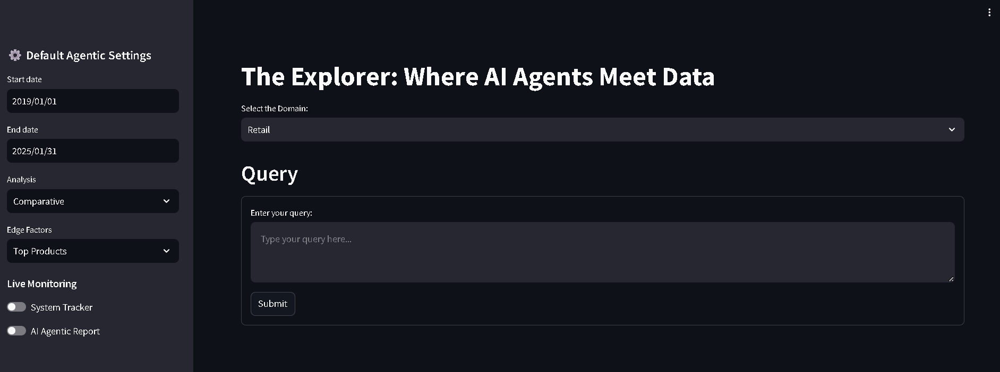

# AI Autonomous System

This system allows users to interact with data through natural language queries. Typing and spelling errors are tolerated by the system to enhance user experience.

💡 **See AI Agents in Action**  
Enable the **AI Agentic Report** to activate intelligent agents that auto-analyze the data. [View runtime info](#ai-agentic-report)

## 🖥️ UI Layout

## Try the Autonomous System:
# [CLICK HERE TO ACCESS THE SYSTEM](https://da62-103-251-59-97.ngrok-free.app/)

## Retail Domain

### Example Queries:
1. I want to see top 10 product in 2022
2. what is the basket ratio of milk and bread?
3. what is the basket ratio of Egg and bread 2022-- Jan to Aug?
4. can you tell me total sales in 2021 in New York?
5. i want to know the total cost of Jam in 2022
6. can you show me payment method distribution?
7. can you show me top 10 products in winter?
8. can you give me full analysis? i wan to see everything which is good for my analysis --If needed, use a pie chart for different distribution visualization.
9. I want to see sales for all seasons and by all different types of customer
10. I want see the sales by seasons-- top 5 products-- top 4 stores

You can review the Data preview to formulate different types of queries.

## Energy Domain

### Deep Agentic Analysis:
* Some aspects of this feature rely on Processed Knowledge of AI-Agents
* You can explore these functionalities by selecting any continuous feature

### Some of the available features:
Input_Pressure, Signal_Stability, Normalized_Drop, Volume_Supply, Output_Heat, Drop_Log, Steam_Level, Water_Level

If you don't want the system to perform Log Transformation, simply type: "dont do any processing" or something similar.

### Example Queries:
1. I want to see general trend of input press -- from jan to aug in 2022
2. Jan to april in 2023: I want to see line chart of Signal stability
3. can you show me stats card of Signal stability, input press and Drop Log Output Heat Entry Level system force-- from jan to april in 2023
4. i want to see stats card and line chart of Output Heat Entry Level system force -- jan to april in 2021
5. can you show me distribution of system force in 2022 jan to april?
6. i want to see histogram of Output Heat Entry Level - 15 feb to 28 March 2021
7. i want to see histogram and box plot of Output Heat Entry Level - 8 of March to end of aug 2020
8. april to 15th aug 2021: i want to see statistics for Water_Level Output Heat Air_Quality Volumesupply
9. show me trend and box plot of Output Heat Entry Level - jan to april 2020
10. dont do any processing : 8. april to 15th aug 2021: i want to see box plot for Water Level Volume supply

## AI Agentic Report

To optimize computing time and generate Agentic reports faster:
* The central knowledge base is restricted in scope.
* Interactions have been reduced for validation of generated information
* Processed knowledge is available to all agents.
* The second configuration file for modifying the behavior of all agents is not provided at this time.
* For both domains: Agentic Report generation may take up to 2 minutes

